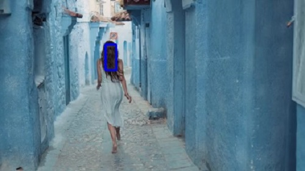

# Single Object Tracking
This project is an implementation for single object tracking based on mean-shift algorithm, coded in Python language.

Here we use 4 different videos (relatively easy to track) to show the tracking result, most of which are from [www.pexels.com](https://www.pexels.com/videos/), an open community for sharing best free stock videos.

## Project Structure
+ Runnable Python source files are [SingleObjectTracking.py](./SingleObjectTracking.py) and [SingleObjectTracking_Built_in.py](./SingleObjectTracking_Built_in.py), and the [former](./SingleObjectTracking.py) is implemented on our own, while the [later](./SingleObjectTracking_Built_in.py) is based on builtin mean-shift of OpenCV. 
JUST CLONE THE REPOSITORY AND RUN IT!
+ Dataset is in [dataset](./dataset) directory, which contains four sets of frames which are [bird](./dataset/bird), [girl_in_the_sea](./dataset/girl_in_the_sea), [girl_in_the_alley](./dataset/girl_in_the_alley) and [girl_in_the_garden](./dataset/girl_in_the_garden).
+ Single object tracking results are in [output](./output) directory, so that you can quickly get the result of this code.

## Algorithm Process of Single Object Tracking
+ Calculate the probability histogram of the given target
+ Calculate the probability histogram of the candidate target
+ Find the candidate target which is the closest to the given target with mean-shift

## Results Representation
+ Demo Frame

  ------

  
  
  
  

+ Demo Video

## Dependency
* [OpenCV 3.4.1](https://opencv.org/opencv-3-4-1/)

## References
* [1] D. Comaniciu and P. Meer, "Mean shift: a robust approach toward feature space analysis," in IEEE Transactions on Pattern Analysis and Machine Intelligence, vol. 24, no. 5, pp. 603-619, May 2002, doi: 10.1109/34.1000236.
* [2] D. Comaniciu, V. Ramesh and P. Meer, "Kernel-based object tracking," in IEEE Transactions on Pattern Analysis and Machine Intelligence, vol. 25, no. 5, pp. 564-577, May 2003, doi: 10.1109/TPAMI.2003.1195991.
* [3] http://cvlab.hanyang.ac.kr/tracker_benchmark/datasets.html

## Author Info
LeoHao (XMU-CS)

## Date
2020.11.20

